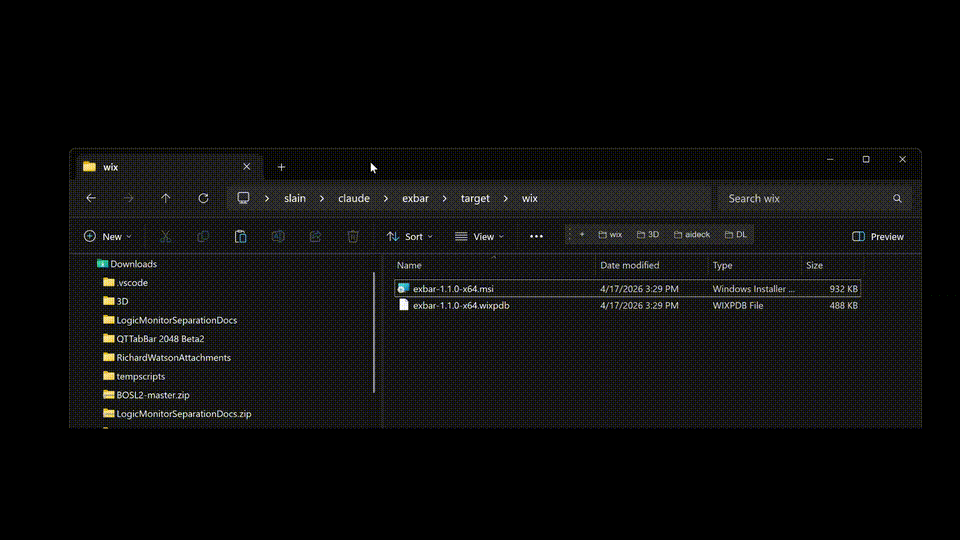
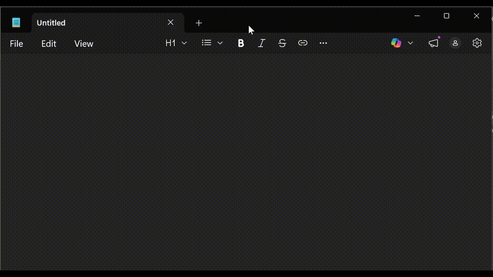
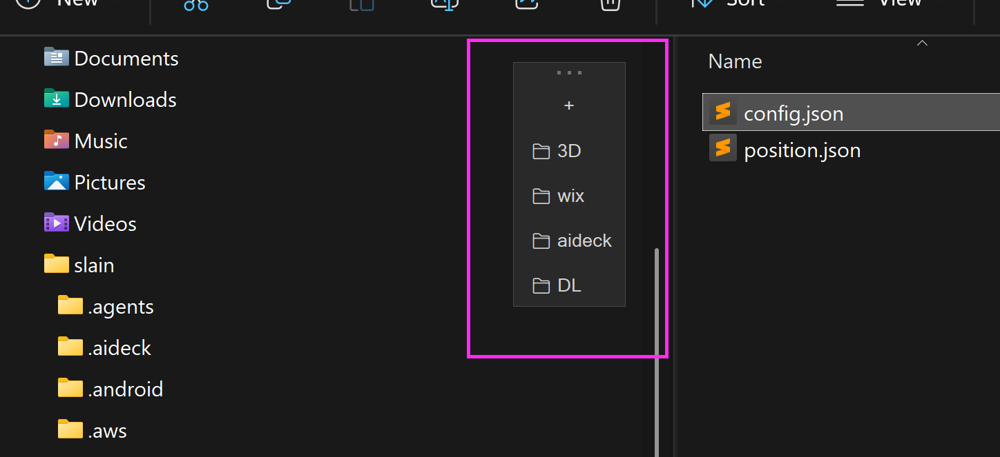

# Exbar

A configurable folder toolbar for Windows 11 File Explorer and Open/Save As dialogs. 






I was a big fan of [GPSoft's Directory Opus](https://www.gpsoft.com.au/) in the early 2000's and then mostly have just used QTTabBar since for tabs and folder bars, but it is now bloated, unsupported ('[original](http://qttabbar.wikidot.com/)' version), and currently broken (including the newer [indiff](https://github.com/indiff/qttabbar) version, or needing deep workarounds) on Windows 11. I previously used it mostly for tabs and folder bars because 'Quick Access' is a terrible UX. This is my Rust-built version now that Windows 11's File Explorer has tab support.  

## Features
* Works with tabs, changing the active tab when clicking a folder in exbar. Ctrl-click to open in new tab.
* Works in normal Save As / Open file dialogs too — click a folder to retarget the dialog instead of Explorer. Drag a file out of the dialog onto a toolbar folder to move or copy it there.
* Drag-n-drop support for moving and copying files with native Windows semantics around ctrl/shift drop.
* Drag-n-drop support for adding folders to Exbar.
* Drag re-sort the order of the folders in Exbar.
* Right click exbar folder for various options, like copy path or rename the shortcut.
* Right click '+' for editing config.
* Remembers relative position and adjusts after drag, resize and maximize events. Vertical layout supported for those with odd tastes.



## Install

Download and install `exbar-1.2.0-x64.msi` from the [latest release](https://github.com/jamison-wilde/exbar/releases/latest).

Windows SmartScreen will warn you that the publisher is unrecognized (the installer is not yet signed). Click **More info** → **Run anyway**.

The installer is per-user (no admin required) and:
- Installs to `%LOCALAPPDATA%\Exbar\`
- Adds **Exbar** to your Start menu so you can re-launch it any time
- Configures the toolbar to auto-start when you sign in

## Use

- **Click a folder button** — the active Explorer window's active tab navigates to that folder
- **Drag a file/folder onto an exbar folder button** — moves (same drive) or copies (different drive) just like it would with a Quick Access folder
  - Hold `Ctrl` to force copy, or `Shift` to force move
- **Drag the grip** (dots on the left edge when horizontal, top edge when vertical) — move the toolbar
- **Right click on the '+'** — to edit then reload the config

Position is remembered across sign-outs. The toolbar auto-hides when you switch to non-Explorer apps.

## Configure

Edit `~\.exbar\config.json` (in your user home folder):

```json
{
  "folders": [
    {"name": "Downloads", "path": "shell:downloads"},
    {"name": "Documents", "path": "shell:personal"},
    {"name": "Projects",  "path": "C:\\Users\\you\\projects"},
    {"name": "Work",      "path": "D:\\work"}
  ],
  "layout": "horizontal", // or "vertical"
  "background_opacity": 0.8,
  "log_level": "info", // exbar.log in %TEMP% usually in AppData\Local\Temp
  "repositionDelayMs": 250, // dial in the time the exbar reappears after a max/unmax
  "enableFileDialogs": true
}
```

**Fields:**
- `folders[].name` — button label (required)
- `folders[].path` — absolute path or `shell:` alias like `shell:downloads`, `shell:desktop`, `shell:personal` (required)
- `layout` — `"horizontal"` (default) or `"vertical"`
- `background_opacity` — 0.0 (transparent) to 1.0 (opaque). Default: 0.8
- `enableFileDialogs` — `true` (default) to light up the toolbar over Save As / Open dialogs. Set to `false` for Explorer-only behavior.

If the file doesn't exist, the installer created a stub for you with Downloads, Documents, and Desktop. Click the refresh button (⟳) on the toolbar after editing.

## For developers

<details>
<summary>Build from source</summary>

```bash
# Build the binaries
cargo build --release

# Build the MSI installer
./scripts/build-msi.sh
```

Prerequisites:
- [Rust toolchain](https://rustup.rs/) — requires the `x86_64-pc-windows-msvc` target (installed by default on Windows)
- [Visual Studio Build Tools](https://visualstudio.microsoft.com/downloads/) with the *Desktop development with C++* workload
- [WiX Toolset v7](https://wixtoolset.org/) — install via `dotnet tool install --global wix`, then `wix eula accept wix7 && wix extension add --global WixToolset.Util.wixext`

See `CLAUDE.md` for architecture notes and the live-iteration build loop.

</details>

## License

MIT — see [LICENSE](LICENSE).
